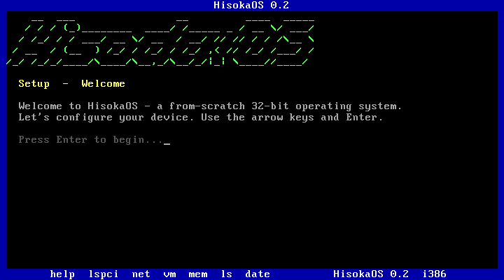
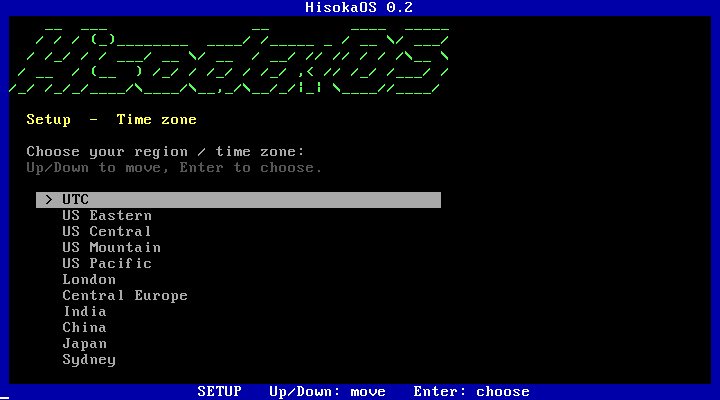

# HisokaOS

A from-scratch 32-bit x86 operating-system kernel, written in C (+ a little
assembly), security-first, no spyware. It **boots on its own kernel** in QEMU and
drops you into an interactive shell. No Linux underneath — this is our own kernel
from the first instruction.





*Real QEMU captures: the kernel booting to its welcome screen, and the interactive setup wizard.*


```
 __  ___                __         ____  _____
/ /_/ / (_)________  ____/ /_____ _ / __ \/ ___/
... a from-scratch C kernel · security-first
```

## What actually works (verified booting)

| Subsystem | File | Status |
|---|---|---|
| Multiboot boot + stack | `boot/boot.s`, `kernel/linker.ld` | ✅ boots via QEMU `-kernel` |
| VGA text console (scroll, cursor, color) | `drivers/vga.c` | ✅ |
| Serial logging (COM1) | `drivers/serial.c` | ✅ |
| `kprintf` (%c %s %d %u %x %p) | `lib/printf.c` | ✅ |
| GDT — ring0/ring3 segments | `cpu/gdt.c` `cpu/gdt_flush.s` | ✅ |
| IDT + ISRs (CPU exceptions 0-31) | `cpu/idt.c` `cpu/isr*.c/.s` | ✅ traps faults |
| IRQs via remapped 8259 PIC | `drivers/pic.c` | ✅ |
| PIT timer (100 Hz uptime) | `drivers/pit.c` | ✅ |
| PS/2 keyboard (shift, ring buffer) | `drivers/keyboard.c` | ✅ interactive |
| Physical memory manager (frame bitmap) | `mm/pmm.c` | ✅ reports real RAM |
| Kernel heap (first-fit kmalloc/kfree) | `mm/heap.c` | ✅ |
| Interactive shell | `kernel/shell.c` | ✅ help/mem/sec/uptime/echo/reboot/panic |

~1,135 lines, **zero compiler warnings** (`-Wall -Wextra`).

## Build & run

```bash
# tools: Apple clang (ships with macOS) + i686-elf-binutils + qemu
brew install i686-elf-binutils qemu
make           # -> hisoka.elf
make run       # boot it in QEMU (serial mirrored to your terminal)
```

## Honest scope — what this is NOT (yet)

This is a real kernel, not a finished desktop OS. A literal "Linux Mint replica"
is ~100 million lines and tens of thousands of person-years — not buildable by hand.
Deliberately **not** here yet, in rough order of how you'd add them:

- **Paging / virtual memory** (GDT has ring3 descriptors, but user-mode isolation
  needs paging + a TSS — not enabled yet).
- **Syscalls + userland processes** (currently everything runs in ring0).
- **A filesystem** (no disk driver / VFS yet).
- **Networking** — and therefore no real firewall yet (the `sec` command documents
  the intended posture; the firewall is roadmap, not reality).
- **A GUI / window manager / apps.**

The security model is the *design* (minimal trusted computing base, ring separation,
no telemetry, faults contained) — the kernel is the honest first ~1% of it, built right.

## Known limitations (from the code review)

- `mm/pmm.c` uses Multiboot `mem_upper` and assumes contiguous RAM above 1 MiB
  rather than walking the full memory map.
- `mm/heap.c` coalesces freed blocks forward only (can fragment over long runs).
- `lib/printf.c` has no field width / zero-padding.
- `drivers/keyboard.c` handles US layout + shift only (no capslock / extended keys).

None of these stop it booting or running the shell; they're the honest next TODOs.
